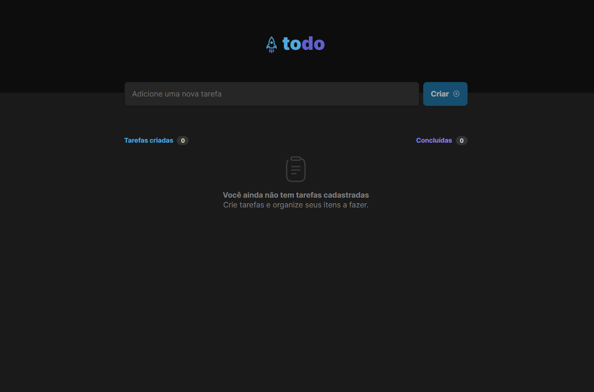
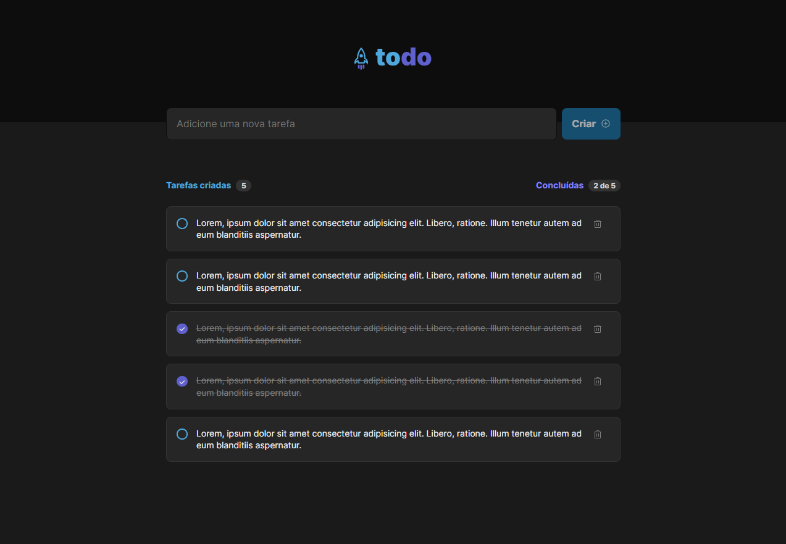

<div align="center">
    
<h1 align="center">To-Do List App</h1>
</div>

## Projeto

Uma aplicação "To-Do List" simples para anotação de tarefas que foi desenvolvida a partir de um layout como desafio da Rocketseat trilha React

## Preview

<p align="left">
  
  
</p>

## Layout

Você pode visualizar o layout do projeto através do link abaixo:

- [Layout Web](<https://www.figma.com/file/MhzQf4UuhhESg4PPodjNcy/ToDo-List-(Copy)?node-id=0%3A1>)

## Tecnologias

Tecnologias utilizadas no projeto:

- [React](https://reactjs.org)
- [Vite](https://vitejs.dev/)
- [TypeScript](https://www.typescriptlang.org/)
- [Phosphor Icons](https://phosphoricons.com/)

## Como utilizar

Basta clonar ou baixar o projeto e acessar sua pasta.

```bash
$ git clone https://github.com/emersonmelomartins/todo-vite-react-typescript.git
```

Após clonar, seguir os passos abaixo para iniciá-lo:

Com NPM:
```bash
# Instalar as dependências
$ npm install

# Iniciar o projeto
$ npm run dev
```

Com YARN:
```bash
# Instalar as dependências
$ yarn

# Iniciar o projeto
$ yarn dev
```

Ao iniciar a aplicação, será inicializado o navegador na URL padrão do projeto: http://localhost:3000

Caso a porta esteja sendo utilizada, no terminal irá informar qual a porta correta.
